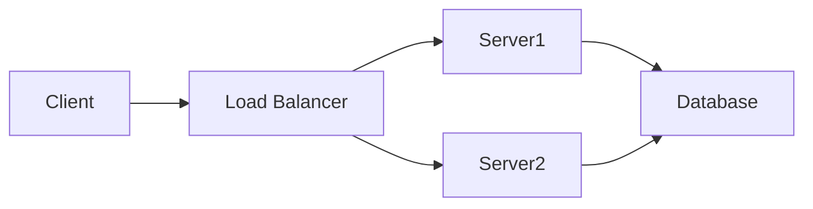
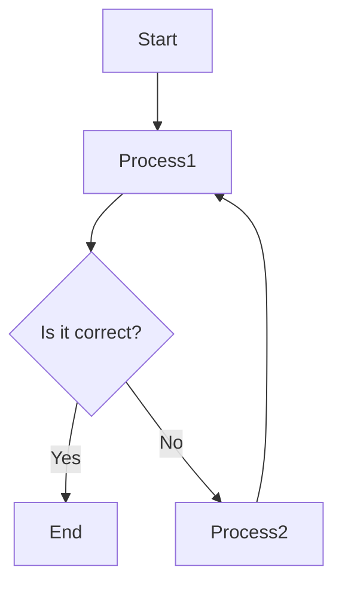
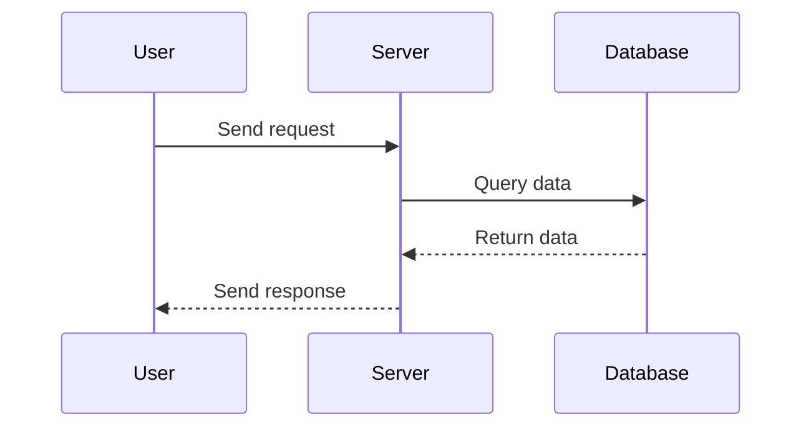

# Crafting Professional Technical Documents with Overleaf and Mermaid

In the realm of academic and professional writing, the ability to produce clear, well-structured, and visually appealing documents is paramount. Whether you're drafting a research paper, developing technical specifications, or composing a thesis, leveraging the right tools can significantly enhance the quality and efficiency of your work. **Overleaf**, a collaborative online LaTeX editor, combined with **Mermaid**, a versatile diagramming tool, offers a powerful solution for creating comprehensive and visually engaging documents. This article delves into how to effectively use Overleaf and Mermaid to engineer diagrams and produce high-quality technical documentation, specifications, and formal research or thesis papers.

## Table of Contents

- [Introduction to Overleaf](#introduction-to-overleaf)
- [Getting Started with Mermaid](#getting-started-with-mermaid)
- [Integrating Mermaid Diagrams into Overleaf](#integrating-mermaid-diagrams-into-overleaf)
- [Applications in Technical Documentation](#applications-in-technical-documentation)
- [Developing Specifications with Overleaf and Mermaid](#developing-specifications-with-overleaf-and-mermaid)
- [Composing Research and Thesis Papers](#composing-research-and-thesis-papers)
- [Best Practices and Tips](#best-practices-and-tips)
- [Conclusion](#conclusion)
- [References](#references)

## Introduction to Overleaf

**Overleaf** is a cloud-based LaTeX editor that facilitates collaborative writing and publishing of scientific documents. It offers real-time collaboration, version control, and a rich set of templates tailored for various types of documents, including research papers, theses, presentations, and technical reports. Overleaf simplifies the complexities of LaTeX, making it accessible to both beginners and seasoned users.

### Key Features of Overleaf

- **Real-Time Collaboration:** Multiple users can work on the same document simultaneously, with changes reflected instantly.
- **Extensive Template Library:** Access to thousands of templates for different document types and journals.
- **Integrated Compiler:** Automatically compiles LaTeX code into PDF, allowing for immediate preview of changes.
- **Version Control:** Track changes, revert to previous versions, and manage document history efficiently.
- **Cloud Storage:** Securely store documents online, accessible from any device with internet connectivity.

## Getting Started with Mermaid

**Mermaid** is a JavaScript-based diagramming and charting tool that uses a simple markdown-like syntax to generate diagrams dynamically. It supports various types of diagrams, including flowcharts, sequence diagrams, class diagrams, and more. Mermaid's ease of use and flexibility make it an excellent choice for embedding diagrams within markdown files, wikis, and now, LaTeX documents via Overleaf.

### Advantages of Using Mermaid

- **Simplicity:** Create complex diagrams using straightforward textual descriptions.
- **Flexibility:** Supports a wide range of diagram types suitable for diverse documentation needs.
- **Integration:** Easily integrates with various platforms, including markdown editors and now LaTeX through Overleaf.
- **Customization:** Offers styling options to match the visual aesthetics of your documents.

## Integrating Mermaid Diagrams into Overleaf

While Overleaf primarily supports LaTeX for document creation, integrating Mermaid diagrams can be achieved through several approaches. Below are two effective methods to embed Mermaid diagrams within Overleaf projects.

### Method 1: Using External Tools and Including as Images

1. **Create Mermaid Diagrams:**
   - Use online Mermaid editors such as [Mermaid Live Editor](https://mermaid.live/) or [Markdown editors with Mermaid support](https://www.typora.io/) to design your diagrams.
   
2. **Export Diagrams:**
   - Once your diagram is ready, export it as an SVG or PNG image.

3. **Include Diagrams in Overleaf:**
   - Upload the exported image files to your Overleaf project.
   - Use the `\includegraphics` command to embed the images into your LaTeX document.

   ```latex
   \documentclass{article}
   \usepackage{graphicx}

   \begin{document}

   \section{System Architecture}
   \begin{figure}[h]
     \centering
     \includegraphics[width=\linewidth]{system_architecture.svg}
     \caption{System Architecture Diagram}
     \label{fig:system_architecture}
   \end{figure}

   \end{document}
   ```

### Method 2: Using the `mermaid` Package with LaTeX

For a more integrated approach, you can use the `mermaid` package in LaTeX, which allows embedding Mermaid code directly within your LaTeX documents. This method requires additional setup but offers a seamless workflow.

1. **Install Node.js and Mermaid CLI:**
   - Ensure that [Node.js](https://nodejs.org/) is installed on your system.
   - Install the Mermaid command-line interface (CLI) globally using npm:

     ```bash
     npm install -g @mermaid-js/mermaid-cli
     ```

2. **Create Mermaid Diagrams:**
   - Write your Mermaid diagram code in separate `.mmd` files.

3. **Automate Diagram Generation:**
   - Use scripts or Makefiles to convert `.mmd` files to images (SVG/PNG) during the compilation process.

4. **Include Diagrams in Overleaf:**
   - Upload the generated images to your Overleaf project.
   - Embed them using `\includegraphics` as shown in Method 1.

**Note:** As of now, direct integration of Mermaid within Overleaf without external processing is limited. The above methods provide practical solutions to incorporate Mermaid diagrams into your LaTeX documents.

## Applications in Technical Documentation

Technical documentation often requires clear and precise diagrams to illustrate systems, workflows, and architectures. Overleaf combined with Mermaid enhances the documentation process in the following ways:

### System Architecture Diagrams

Illustrate the components of a system and their interactions.



*Example Diagram: System Architecture*

### Flowcharts

Visualize processes, decision-making paths, and workflows.



*Example Diagram: Process Flowchart*

### Sequence Diagrams

Depict interactions between entities over time, useful for illustrating protocols or communication flows.



*Example Diagram: Sequence of Interactions*

## Developing Specifications with Overleaf and Mermaid

Creating technical specifications requires detailed explanations complemented by diagrams to clarify complex concepts. Using Overleaf and Mermaid facilitates the production of comprehensive specifications through:

### Clarity and Precision

- **Textual Descriptions:** Utilize LaTeX's robust typesetting for precise documentation.
- **Visual Aids:** Incorporate Mermaid diagrams to visualize system components, workflows, and data models.

### Consistency and Maintenance

- **Version Control:** Overleaf's versioning ensures that changes are tracked and managed efficiently.
- **Modular Diagrams:** Maintain diagrams as separate Mermaid files for easy updates and reuse across documents.

### Example: API Specification

```latex
\section{API Specification}

The following diagram illustrates the interaction between the client application and the server API.

\begin{figure}[h]
  \centering
  \includegraphics[width=0.8\linewidth]{api_sequence.svg}
  \caption{API Interaction Sequence}
  \label{fig:api_sequence}
\end{figure}

\subsection{Endpoints}

\begin{itemize}
  \item \textbf{GET /users}: Retrieve a list of users.
  \item \textbf{POST /users}: Create a new user.
  \item \textbf{PUT /users/{id}}: Update user details.
  \item \textbf{DELETE /users/{id}}: Remove a user.
\end{itemize}
```

*The accompanying `api_sequence.svg` would be generated from a Mermaid sequence diagram detailing the API interactions.*

## Composing Research and Thesis Papers

Research and thesis papers demand meticulous organization, extensive referencing, and the inclusion of various diagrams to support findings and methodologies. Overleaf and Mermaid streamline this process by offering:

### Structured Document Creation

- **Sections and Subsections:** Organize content logically using LaTeX's sectioning commands.
- **Automatic Numbering and Referencing:** Seamlessly reference figures, tables, and sections.

### Enhanced Visual Representation

- **Data Flow Diagrams:** Represent data processing and system interactions.
- **Class and Entity-Relationship Diagrams:** Useful for software engineering and database design topics.

### Example: Methodology Section

```latex
\section{Methodology}

Our research methodology is illustrated in Figure \ref{fig:research_methodology}.

\begin{figure}[h]
  \centering
  \includegraphics[width=\linewidth]{research_methodology.svg}
  \caption{Research Methodology Flowchart}
  \label{fig:research_methodology}
\end{figure}

The study follows a qualitative approach, involving data collection through interviews and surveys, followed by data analysis using thematic coding.
```

*The `research_methodology.svg` would be a Mermaid flowchart depicting the steps of the research process.*

## Best Practices and Tips

To maximize the effectiveness of Overleaf and Mermaid in your documentation and academic writing, consider the following best practices:

### For Overleaf

- **Leverage Templates:** Utilize Overleaf's extensive template library to kickstart your projects.
- **Collaborate Effectively:** Use the collaboration features to work seamlessly with co-authors.
- **Master LaTeX Basics:** Familiarize yourself with essential LaTeX commands to enhance document formatting and styling.

### For Mermaid

- **Plan Your Diagrams:** Before coding, outline the structure and components of your desired diagram.
- **Keep It Simple:** Avoid overly complex diagrams; clarity should be your priority.
- **Consistent Styling:** Maintain a consistent style across all diagrams to ensure a professional look.
- **Reuse Components:** Utilize Mermaid's reusable components and templates to save time and maintain consistency.

### Integrating Both Tools

- **Automate Diagram Generation:** Use scripts to convert Mermaid diagrams to images during the compilation process, ensuring that your diagrams are always up-to-date.
- **Organize Diagram Files:** Store all Mermaid files in a dedicated directory within your Overleaf project for easy access and management.
- **Version Control for Diagrams:** Track changes to your Mermaid files separately to manage updates without affecting the main document structure.

## Conclusion

Combining **Overleaf** and **Mermaid** offers a robust solution for creating high-quality technical documentation, specifications, and academic papers. Overleaf's powerful LaTeX environment ensures that your documents are professionally formatted and easy to manage, while Mermaid provides a straightforward method for generating insightful and visually appealing diagrams. By integrating these tools, you can enhance the clarity, coherence, and overall quality of your technical and academic writings, making your work stand out in both professional and scholarly arenas.

## References

1. **Overleaf:** [https://www.overleaf.com](https://www.overleaf.com)
2. **Mermaid Documentation:** [https://mermaid-js.github.io/mermaid/#/](https://mermaid-js.github.io/mermaid/#/)
3. **LaTeX Project:** [https://www.latex-project.org](https://www.latex-project.org)
4. **Mermaid Live Editor:** [https://mermaid.live](https://mermaid.live)
5. **GitHub - Mermaid:** [https://github.com/mermaid-js/mermaid](https://github.com/mermaid-js/mermaid)
6. **Overleaf Templates:** [https://www.overleaf.com/gallery](https://www.overleaf.com/gallery)